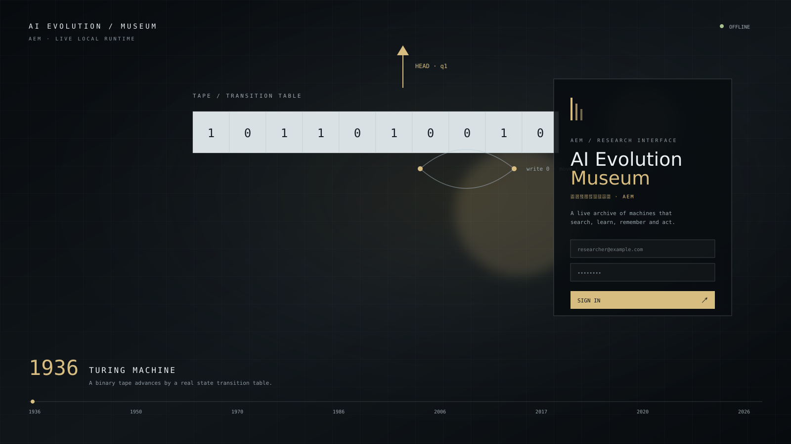

# AI Evolution Museum (AEM) · 人工智能演化博物馆

AI Evolution Museum is an offline-first interactive history of machine intelligence. It is a working visual laboratory rather than a particle wallpaper: every scene advances a deterministic algorithm, exposes its state, and can be paused, stepped, reset, seeded, and inspected.

## Run it

```bash
npm install
npm run dev
```

For a production bundle:

```bash
npm run build
npm run preview
```

The core museum runs without a network connection and never calls a paid LLM API. Authentication is a local demo login; the experiments use rules, synthetic data, and tiny browser-side calculations.

## What is included

- Minimal login experience with a live experiment visible behind it.
- Chronological, classic-only, modern-only, and random autoplay modes.
- 30 executable scenes from the Turing machine to a partial-observation world-model agent.
- A shared experiment contract, fixed-timestep runtime, seeded replay, performance quality levels, and cleanup lifecycle.
- Searchable Experiment Library plus a detail panel with origin, historical scope, significance, formula, current metrics, parameters, and controls.
- Presentation mode (`F` or `?presentation=1`), PNG capture with optional JSON metadata, keyboard controls, reduced-motion and high-contrast support, and a debug overlay (`?debug=1`).
- Timeline that fades in at the bottom edge and becomes a drawer on small screens.
- A quiet optional Web Audio soundscape for steps and transitions; it is off by default and contains no music.

## Screenshots and capture mode

The museum is intentionally generated at runtime rather than shipped as a video. Press `S` or choose Capture Frame to download a PNG of the current Canvas frame; enable “Include screenshot metadata” in Settings to also export a JSON record with the experiment, year, seed and metrics. `?presentation=1` opens the UI-free exhibition/screenshot composition.



This is a documentation preview of the login composition and a deterministic Turing scene; the live background is computed by the browser at runtime, not played from this image.

## Experiment catalogue

Turing Machine · Finite State Machine · Boolean Logic Network · McCulloch–Pitts Neuron · Imitation Game · Minimax · Alpha–Beta Pruning · Perceptron · ELIZA Style Rules · A* · Dijkstra · Conway's Game of Life · Expert System · Hopfield Network · Backpropagation · Cellular Evolution · Genetic Algorithm · Q-learning · SARSA · Self-Organizing Map · K-Means · Decision Tree · Chess Search · Monte Carlo Tree Search · CNN Feature Extraction · 2D GAN · Transformer Attention · Autoregressive Language Model · Diffusion · Agent + World Model.

## Controls

`Space` pause/resume · `←/→` previous/next scene · `R` reset · `F` presentation/fullscreen · `S` capture PNG · `D` toggle debug. The visible controls duplicate these actions for keyboard and touch users. Timeline modes include Auto loop, Chronological, Classic only, Modern only and Seeded random museum.

## Architecture

`src/experiments/` contains algorithm modules and the registry. `src/runtime/` owns the fixed timestep, seed, resize, lifecycle, adaptive quality and display-only draw budgets. `src/renderer/` and `src/transitions/` provide the shared visual layer. `src/timeline/` and `src/history/` provide the director and historical metadata. `src/app/` and `src/components/` are the React shell.

To add an experiment, implement the shared definition/instance contract, export it from `src/experiments/registry.ts`, add a historical record, and add a deterministic test under `tests/`.

## Accuracy and licensing

Scenes are labelled historical algorithm, educational reconstruction, or modern simplification. The museum does not claim to reproduce original hardware or complete systems such as AlphaGo or a modern language model. The project is released under the MIT License; see `LICENSE`, `HISTORY.md`, `REFERENCES.md`, and `THIRD_PARTY_NOTICES.md`.
